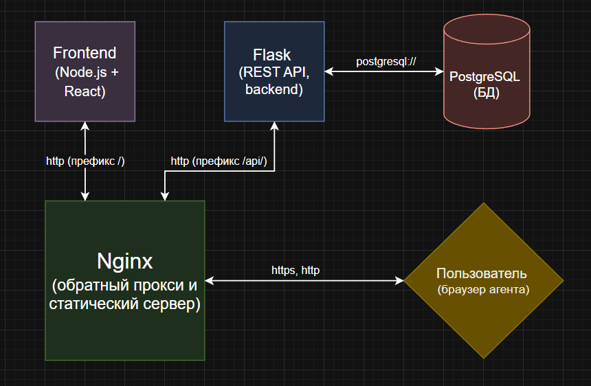

# TeamSync
Сервис для поиска тимейтов

Дополнительная документация находится в файле `DOCS.md` (по расширению) и `DEV.md` (документация по разработке этого проекта)

# Инструкция по запуску
Запуск возможен в двух режимах: `dev` и `production` 
(через docker (технология контейнеризации)), 1 способ сложнее, но быстрее в плане 
запуска сервера (важно тк при разработке он часто
перезапускается), и медленнее в плане обработки запросов
запускает только API, но дополнительно нужно 
установить PostgreSQL на пк. Второй способ нужен 
для запуска в условиях реального сервера, для него 
нужно установить только docker, остальное (PostgreSQL,
Nginx) docker сам подтянет с образов. Для проверки проекта лучше использовать способ через docker.

## Запуск в production mode
### 1. Установка и запуск Docker и Docker-compose
Для Windows: 
1. Скачайте Docker Desktop с сайта: https://www.docker.com/products/docker-desktop
2. Запустите установочный файл и следуйте инструкциям установщика
3. После установки Docker Desktop должен сам запуститься, если этого не произошло то надо найти через поиск в меню Пуск `docker` и запустить вручную

Для Linux:
```bush
sudo apt-get install docker-ce docker-ce-cli containerd.io docker-buildx-plugin docker-compose-plugin
```
### 2. Запуск контейнеров
Перейдите в корень проекта (на один уровень с README.md) с помощью `cd`
```bush
docker-compose up --build
```
После этого сайт будет доступен по адресу http://localhost, а логи БД, Nginx, фронтенда и API будут появляться в терминале,

# Архитектура
Архитектура была выбрана монолитная с четким разделением на бэкенд и фронтенд, мы отказались от шаблонизации (тк этот подход устарел и почти не используется в современных серьезных проектах) в пользу современного подхода взаимодействия бэкенда и фронтенда через REST API, вот схема взаимодействия сервисов:



### Описание сервисов
 - `Flask`: REST API, использует http и json как формат передачи данных, в качестве сервера используется Guvicorn
 - `Node.js + React`: фронтенд с современным подходом
 - `PostgreSQL`: Самая популярная БД на данный момент в продакшен среде, в разы быстрее SQLite, имеет в разы больший функционал
 - `Nginx`: обратный прокси и сервер статики, перенаправляет запросы с префиксом /api/ на бэкенд сервер, а с префиксом / на фронтенд


# Подход к бэкенд разработке (свое расширение)
Так как мы выбрали тяжелый путь REST, а Flask это не REST фреймворк (да есть расширение flask-restfull, но оно не дает средств для проектирования API а просто переносит принцип REST во flask, но сам процесс разработки почти такой же как и на обычном Flask) то мы решили создать свое расширение которое упростит разработку API и превратит Flask в нормальный REST фреймворк

##### Функции расширения
1. Автоматическая валидация через Pydantic (как при запросе так и при ответе)
2. Автоматическое создание (с возможностью дополнения) openapi документации на основе системы типов и сигнатур функций
3. Просмотр документации в сгенерированном SwaggerUI
4. Легко встраиваемая аутентификация через JWT токен 
5. Перевод API исключений в REST формат
6. Возможность возврата ответа в функции представления в разном виде

При создании расширения опирались на концепции фреймворка FastAPI, который считается самым популярным python фреймворком для создания API, получилось очень похоже, подробную документацию к расширению можно почитать в файле `DOCS.md`

##### Можно **уверенно** заявить что созданное расширение может существовать как самостоятельный проект независимо от этого и переиспользоваться **бесконечное количество раз**

